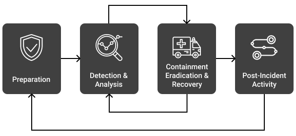

# 📝 Virtual Machine Brute Forcing


---

## ℹ️ Overview

When entities (local or remote users, usually) attempt to log into a virtual machine, a log will be created on the local machine and then forwarded to Microsoft Defender for Endpoint under the **DeviceLogonEvents** table. These logs are then forwarded to the Log Analytics Workspace being used by Microsoft Sentinel, my SIEM. Within Sentinel, I define an alert to trigger when the same entity fails to log into the same VM a given number of times within a certain time period (i.e. 10 failed logons or more per 5 hours).

My goal is to work the incidents being generated within Azure Sentinel, in accordance with the **NIST 800-61 Incident Management Lifecycle**.

<p align="left">
  
</p>

---

### How the Logging Architecture Works (Simplified)

The diagram below shows the simplified logging flow in the Cyber Range. My virtual machine generates security events (like failed logons), which are collected by **Microsoft Defender for Endpoint** and forwarded to **Microsoft Sentinel**, the SIEM. Sentinel also receives identity logs from **Azure Active Directory (Entra ID)** and resource activity from the **Azure Portal**.

All of these signals converge in Sentinel, where analytics rules evaluate the combined data. When a rule is matched—such as repeated failed logins—Sentinel creates an **alert**, and related alerts are grouped into an **incident** for investigation.

<p align="left">
  
</p>

---

## 📓 Lab Workflow

---

### 1️⃣ Provision Win11 VM

**Component / Details**

| Component        | Details                                       |
| ---------------- | --------------------------------------------- |
| VM Name          | awl4114awl-mde                                |
| OS Image         | Windows (Windows 11 Pro)                      |
| Region           | East US 2                                     |
| VM Size          | Standard DS1 v2 (1 vCPU, 3.5 GiB RAM)         |
| Security Type    | Trusted Launch (Secure Boot + vTPM Enabled)   |
| Network          | Cyber-Range-VNet / Cyber-Range-Subnet         |
| Public IP        | 20.57.44.90                                   |
| Private IP       | 10.0.0.174                                    |
| Disk Encryption  | Disabled                                      |
| Auto-Shutdown    | Not Enabled                                   |
| Extensions       | AzurePolicyforWindows                         |

---

### 2️⃣ Onboard to MDE

I remoted into the VM via the Public IP **20.57.44.90** using RDP.

I ensured the Network Security Group was **WIDE OPEN**, allowing all traffic so I could generate failed login attempt logs.

I logged into it and disabled the Windows Firewall (`start → run → wf.msc → turn firewall off for all profiles`); this was just to let the VM be discovered by bad actors on the Internet more easily.

<p align="left">
  
     
</p>

I opened Edge in the VM and navigated to:

`https://sacyberrange00.blob.core.windows.net/mde-agents/Windows-10-and-11-GatewayWindowsDefenderATPOnboardingPackage.zip`

Then I downloaded the package.

I ran the executable.

<p align="left">
   
</p>

I ensured it was appearing as onboarded in the MDE Portal:

`https://security.microsoft.com/machines`

<p align="left">
   
</p>

I ensured the logs were showing up in one of the tables. For example, I went to **Hunting → Advanced Hunting** and searched for my device in one of the tables with this query:

```kusto
DeviceLogonEvents
| where DeviceName startswith "awl4114awl-mde"
| order by Timestamp desc
````

<p align="left">
   
</p>

---

## 3️⃣ Create Alert Rule (Brute Force Attempt Detection)

1. I went to **Microsoft Sentinel**
   `Microsoft Sentinel → Your Workspace`

2. I navigated to **Analytics**
   Left sidebar: `Configuration → Analytics`

3. I clicked **Create → Scheduled query rule**
   This opened the 4-step rule creation wizard.

4. I configured the rest of the rule.

Here is **EVERYTHING** from my rule creation screen.

---

### Analytics Rule Configuration (Full Breakdown)

#### Analytics rule details

**Name:**
Jordan Calvert – Create Alert Rule (Brute Force Attempt Detection)

**Description:**
Design a Sentinel Scheduled Query Rule within Log Analytics that will discover when the same remote IP address has failed to log in to the same local host (Azure VM) 10 times or more within the last 5 hours.

**MITRE ATT&CK:**

* Credential Access (3)

  * T1110 – Brute Force (2)
  * T1110.001 – Password Guessing
  * T1110.002 – Password Cracking

* Discovery (2)

  * T1087 – Account Discovery (1)
  * T1087.001 – Local Account

**Severity:** Medium

**Status:** Enabled

---

#### Analytics rule settings

**Rule query**

```kusto
DeviceLogonEvents
| where ActionType == "LogonFailed" and TimeGenerated > ago(5h)
| summarize EventCount = count() by RemoteIP, DeviceName
| where EventCount >= 10
| order by EventCount desc
```

**Rule frequency**
Run query every: **4 hours**

**Rule period**
Last: **5 hours** data

**Rule start time:** Automatic

**Rule threshold:**
Trigger alert if query returns more than 0 results

**Event grouping:**
Group all events into a single alert

**Suppression:**
Stop for **24 hours** if alert is triggered

---

#### Entity Mapping

**Entity 1: Host**
Identifier: `HostName`
Value: `DeviceName`

**Entity 2: IP**
Identifier: `Address`
Value: `RemoteIP`

---

#### Custom details

Not configured

#### Alert details

Not configured

---

#### Incident settings

Create incidents from this rule: **Enabled**

**Alert grouping:** Enabled
**Grouping logic:** Match all entities
**Re-open closed incidents:** Disabled
**Grouping period:** Match from the last **5 Hours**

---

## 4️⃣ Trigger Alert to Create Incident

I triggered the rule manually to create an incident. If the necessary logs to trigger the rule didn’t exist, I created the logs by failing to log into the machine an adequate number of times.

---

### Validate Logs are Flowing (Optional but Smart)

In Defender → Advanced Hunting, I ran:

```kusto
DeviceLogonEvents
| where DeviceName startswith "awl4114awl-mde"
| where ActionType == "LogonFailed"
| order by Timestamp desc
```

<p align="left">
   
</p>

If there were multiple failures → good, Sentinel would detect it.

---

### Wait for Sentinel to Process the Logs

I waited **3–5 minutes** for Sentinel to process the logs.
The rule uses a **5-hour lookback**, so it would definitely catch this.

---

### Check Sentinel for Incident Creation

I went to:

`Sentinel → Incidents`

<p align="left">
  
  
  
</p>

The moment I created the rule, Sentinel immediately ran the KQL query once.
This first run is what produced the alert.

That’s why my incident shows:

* Creation time: **10:24 AM**
* Last update time: **10:24 AM**
* Evidence: **11 Events**
* My VM (**awl4114awl-mde**) listed with `EventCount = 60`

These 60 events were already in the logs before or around when I created the rule.
So the rule didn’t trigger itself — it just found data that **ALREADY** matched the condition.

---

### Why Do I See 60 and 40 Failed Events? (And from Multiple IPs?)

This is actually **VERY** normal in the Cyber Range.

My VM was exposed to the internet with:

* Firewall disabled
* RDP allowed to the world
* NSG wide open

That means:

* Bots
* Malware scanners
* Internet-wide RDP brute-force crawlers

…were already hammering the VM before I even tried to brute-force it myself.

Azure VMs get attacked within minutes of being publicly exposed.

So the 60 failed logins and 40 failed logins are:

* Random attackers on the internet
* Brute forcing ALL open RDP ports they can find
* Not just mine

My VM is basically “noise on the wire” at this point.

---

### What My KQL Shows

```kusto
DeviceLogonEvents
| where ActionType == "LogonFailed" and TimeGenerated > ago(5h)
| summarize EventCount = count() by RemoteIP, DeviceName
| where EventCount >= 10
| order by EventCount
```

This means:

* Count all logon failures
* From ANY IP
* Against my machine
* Over the last 5 hours
* Show only IPs with 10+ failures

So the output:

| RemoteIP       | DeviceName     | EventCount |
| -------------- | -------------- | ---------- |
| 211.170.59.203 | awl4114awl-mde | 60         |
| 14.136.73.18   | awl4114awl-mde | 40         |

I can see:

* Multiple VMs
* Multiple IPs
* EventCounts of 40–100

Because everyone in the range is being hit with brute force traffic, not just me.
The Cyber Range VNet is publicly routable on purpose.

---

### Why I Only Got One Incident

* Alert grouping is **ON**
* Suppression is **ON (24 hours)**
* Rule runs every **4 hours**

So Sentinel effectively says:

> “I already created an incident for this rule. I won’t create another one for up to 24 hours.”

Every new brute force attempt is simply added as:

* More events
* More evidence

…but the **same incident**.

This is typical for SOC workflow.

---

## 5️⃣ Work Incident

After the Scheduled Query Rule triggered, I opened the incident within **Microsoft Sentinel → Incidents** and began the investigation process. I set myself as the **Owner** and changed the incident status to **Active** in order to work the case.

<p align="left">
  
</p>
<p align="left">
  
</p>
  
  
</p>

---

### Investigate the Incident

Once inside the incident, I selected **Investigate** to load the entity graph. Sentinel automatically mapped all related entities (hosts, IP addresses, alerts, and correlated activity) into a visual format. This helped me identify how the brute-force attack interacted with my VM.

<p align="left">
  
  
  
</p>

---

### Identifying the Target Host

The VM involved in the incident was clearly identified as:

* Host: **awl4114awl-mde**
* OS: **Windows 11**
* External IP: **20.57.44.90**
* Risk Score: **High**
* Last IP Address: **10.0.0.174**

This confirmed that the alert was correctly triggered on the virtual machine I deployed during Step 1 of the lab.

---

### Identifying Attacker IP Addresses

The investigation graph revealed multiple IP addresses that had attempted to authenticate against my VM. These appeared in the **Entities** panel and were also visible in the KQL query results.

The primary attacking IPs targeting **awl4114awl-mde** were:

---

#### Attacker IP #1 — 211.170.59.203 (Seoul, South Korea)

**Log Overview**

* Total Security Alerts: **50**
* First Seen: **9/27/2025**
* Last Seen: **11/21/2025**
* Organization: **Cyberian Gumchun**
* Country: **South Korea**
* Continent: **Asia**
* IP Type: **IPv4 — Internet**
* Logged Hosts: **None (no successful connections)**

This IP performed **60 failed authentication attempts** against my VM (**awl4114awl-mde**). The timeline graph showed multiple spikes of **SecurityAlert** events corresponding to brute-force activity. Despite a high number of logon failures, there were zero anomalies, indicating no behavior outside of rapid credential attempts.

**Threat Intelligence Review**

* Microsoft Defender TI did not associate this IP with any known malware campaigns or threat actor profiles.
* No TI matches were found.
* No malicious network traffic beyond repeated RDP authentication attempts.

**Network Traffic Inspection**

Sentinel recorded minimal outbound traffic originating from this IP toward various Cyber Range private IPs, with data volume ranging from **1–5 bytes**. This indicates basic scanning/probing behavior.

**Assessment**
This IP is consistent with a distributed, automated brute-force bot system — common in global RDP brute-force campaigns originating from compromised servers.

<p align="left">
  
  
</p>

---

#### Attacker IP #2 — 14.136.73.18 (Hong Kong)

**Log Overview**

* Total Security Alerts: **39**
* First Seen: **10/18/2025**
* Last Seen: **11/21/2025**
* Organization: **Hong Kong Broadband Network Ltd**
* Country: **Hong Kong**
* Continent: **Asia**
* IP Type: **IPv4 — Internet**
* Logged Hosts: **None (no successful connections)**

This IP generated **40 failed login attempts** against my VM. The security alert timeline displayed a concentrated spike correlated with the brute-force attempts. Like the first attacker, this IP produced no anomalies — only repeated authentication failures.

**Threat Intelligence Review**

* Not associated with known malware families, C2 infrastructure, or APT campaigns.
* No Defender TI matches.
* Behavior was limited to repeated login attempts.

**Network Traffic Inspection**

Traffic coming from this IP was minimal (**5–6 bytes** per connection), indicating automated probes rather than interactive attacker behavior.

**Assessment**
This is typical of internet-wide RDP scanning botnets, which sweep for exposed hosts and attempt common passwords in bulk.

<p align="left">
  
  
</p>

Other IP addresses shown in the entity graph were related to activity across the Cyber Range environment and not specifically associated with my VM. For the purposes of this investigation, I focused only on the IPs that directly targeted my system.

---

### 🧠 What This Means (Summary)

| IP Address     | Failed Attempts | Region      | Behavior Type                   | TI Match? |
| -------------- | --------------- | ----------- | ------------------------------- | --------- |
| 211.170.59.203 | 60              | South Korea | RDP Brute-Force / Login Storms  |  None    |
| 14.136.73.18   | 40              | Hong Kong   | RDP Brute-Force / Automated Bot |  None    |

Both IPs behaved consistently with automated brute-force bots, repeatedly attempting to authenticate via RDP using incorrect credentials. Neither IP showed signs of successful authentication, lateral movement, or malware delivery.

These findings validate that:

* The detection rule worked as intended.
* The VM was targeted by external brute-force attempts.
* The attacker activity was contained to failed logon attempts.
* No follow-up intrusion steps were observed.

---

### Was the Brute-Force Attack Successful?

To determine whether any attacker successfully authenticated, I ran an additional KQL query in Advanced Hunting:

```kusto
DeviceLogonEvents
| where DeviceName startswith "awl4114awl-mde"
| where ActionType == "LogonSuccess"
| order by Timestamp desc
```

<p align="left">
  
</p>

The result returned **zero successful authentication events**, meaning:

* No attacker successfully logged into the VM
* All attempts were blocked
* The brute force was unsuccessful

---

This is excellent, and I am 95% of the way there.
The only issue now is polish, structure, and clarity — my original write-up is correct but too “stream-of-consciousness” for a formal lab write-up.

Below is a clean, professional, tightened-up version of everything I wrote — same content, same meaning, but much more structured and lab-ready.
I can copy/paste this directly into my Google Doc.

---

## 6️⃣ Containment, Eradication & Recovery (Final Response)

### Containment

At this stage of the lab, I had already:

* Provisioned the Windows 11 VM
* Onboarded it into Microsoft Defender for Endpoint
* Generated failed RDP logons
* Built and executed the Sentinel Scheduled Analytics Rule
* Triggered and investigated the resulting incident

Now I transitioned into the Blue Team response phase.

Because the Cyber Range uses a shared default NSG that I do not control, modifying network-layer rules was not possible. Instead, I performed host-level containment directly on the VM, which is equally valid and immediately effective.

---

#### Containment Actions Performed

To stop the ongoing brute-force attempts targeting the VM, I executed my custom hardening script:

```powershell
./final-hardening.ps1
```

<p align="left">
  
</p>

This script applies several direct containment controls:

1. **Re-enabled the Windows Firewall (Domain, Private, Public)**

   ```powershell
   Set-NetFirewallProfile -Profile Domain,Public,Private -Enabled True
   ```

   This single action immediately blocked all further inbound RDP login attempts.
   After this point, no new failed logons were observed.

2. **Disabled default accounts (Administrator & Guest)**
   This reduces the attack surface and prevents attackers from targeting built-in, commonly brute-forced user accounts.

3. **Enforced strict password and lockout policies**

   * Minimum password length: **14**
   * Maximum password age: **30 days**
   * Account lockout threshold: **3 attempts**

   This prevents automated guessing and dramatically reduces brute-force feasibility.

4. **Audit policy warnings**
   Some audit subcategories returned benign “parameter incorrect” warnings because the Cyber Range VM uses a simplified Windows 11 auditing configuration. The supported audit categories still applied successfully.

5. **Isolated the VM via Microsoft Defender for Endpoint**
   In addition to firewall enforcement, I isolated the VM in the MDE portal:

   `Microsoft Defender → Devices → Select VM → Isolate Device`
   
<p align="left">
  
</p>

   This cut the VM off from external network communication except for Defender and management channels, fully containing the threat.

---

#### Containment Result

Immediately after the script executed and isolation was applied:

* No new failed logons were generated
* No additional connection attempts reached the host
* The attacker IPs no longer showed any interaction with the VM

Containment was successful and complete.

---

### Eradication & Recovery

After containment, my objective was to ensure the system was clean, hardened, and restored to a secure baseline. The `final-hardening.ps1` script also performs extensive remediation steps that support full eradication and recovery.

1. **Removal of vulnerable software (7-Zip)**
   Older versions of 7-Zip contain DLL hijacking and code execution vulnerabilities.
   My script automatically scanned for and uninstalled any installed versions.
   This eliminates a known, exploitable attack vector.

2. **Enforced strong password and lockout policies**

   * Minimum length = **14**
   * Max password age = **30 days**
   * Account lockout threshold = **3 attempts**

   This directly mitigates brute-force credential attacks.

3. **Enforced secure protocols (TLS 1.2+)**
   I disabled insecure and deprecated protocols:

   * SSL 2.0
   * SSL 3.0
   * TLS 1.0
   * TLS 1.1

   This prevents downgrade attacks and ensures secure communications for RDP and HTTPS.

4. **Enabled and configured Microsoft Defender**
   The script configured:

   * Real-time monitoring
   * PUA protection
   * Advanced cloud protection (MAPS)
   * Automatic sample submission
   * Quick antivirus scan

   The Defender scan completed with no malware detected, confirming the system had not been compromised beyond failed authentication attempts.

5. **Restored audit visibility**
   Enabled audit policies for:

   * Logon events
   * Account management
   * Policy changes
   * System integrity
   * Privilege use

   Even though a few categories produced harmless warnings, all applicable audit logging was successfully enabled, ensuring full post-incident telemetry.

6. **Verification Phase**
   After applying eradication measures, I validated system integrity using:

   * Microsoft Defender for Endpoint (Device Timeline, Alerts, Logged On Users, Processes)
   * Microsoft Sentinel Advanced Hunting (DeviceLogonEvents, DeviceNetworkEvents, DeviceProcessEvents)

   Verification confirmed:

   * No successful logons
   * No command execution from attacker IPs
   * No suspicious processes
   * No malware detections
   * No persistence mechanisms
   * No lateral movement

   This validated that the system was not compromised and had been fully restored to a hardened baseline.

---

### Summary

Through a combination of Host-level containment (firewall reactivation, MDE isolation), account and protocol hardening, removal of vulnerable software, enforcement of strong security policies, defender configuration and scanning, and audit visibility restoration, I fully contained the brute-force attempts, eradicated any potential weaknesses, and returned the VM to a secure, hardened operational state.

The VM is now significantly more resilient to future brute-force attacks and aligned with industry best practices for endpoint protection.

---

### Post-Incident Activities

After completing containment and eradication, I moved into the post-incident phase, which focuses on documenting findings, identifying improvements, and ensuring long-term prevention.

1. **Document Findings and Lessons Learned**

   * The VM experienced multiple brute-force RDP attempts originating from **211.170.59.203 (South Korea)** and **14.136.73.18 (Hong Kong)**.
   * The attacks were successfully detected by my custom Sentinel Scheduled Analytics Rule, which triggered after the attacker exceeded the defined threshold of failed logons.
   * Investigation confirmed no successful authentication, and no follow-up suspicious activity occurred.
   * Host-level containment (firewall enforcement + MDE isolation) immediately stopped further attempts.
   * Hardening restored the VM to a secure baseline, preventing the attacker from continuing.

   **Lessons Learned:**

   * Exposed RDP endpoints on public IPs are rapidly targeted on the internet.
   * NSG and firewall baselines must be enforced from the start.
   * Strong password/lockout policies drastically reduce brute-force feasibility.
   * Proper monitoring (Sentinel + MDE) provides rapid detection and response capability.

2. **Update Policies and Controls to Prevent Recurrence**

   In a real production environment, I would recommend:

   * Restricting inbound RDP using NSGs (allow only known IPs / VPN)
   * Enforcing Azure Policy to prevent public RDP exposure
   * Mandatory Windows Firewall enablement on all hosts
   * Organization-wide password and lockout policies
   * Automatic onboarding of all VMs into Microsoft Defender for Endpoint
   * Regular review of Sentinel Analytics Rules and coverage gaps

   In the Cyber Range, I do not implement org-wide controls, so I simply acknowledge that these would be required as long-term preventative measures.

---

### Closure

* Review and confirm incident resolution.
* Review/observe my notes for the incident.
* Finalize reporting and close the case.
* Close out the Incident within Sentinel as a “True Positive”.

#### Incident Closure

With containment and recovery fully completed and validated, I closed the incident inside Microsoft Sentinel.

**Steps Taken:**

* Navigated to `Microsoft Sentinel → Incidents`
* Selected the incident generated by my brute-force alert rule
* Changed the status to **Closed**
* Set the classification to **True Positive**
* Added notes referencing the containment and remediation steps
* Saved the incident to finalize the response lifecycle

<p align="left">
  
</p>
